# UniTracks

Cross-Plattform Sport-Tracking-App mit **.NET 11** und **.NET MAUI** — Fokus auf Datensicherheit und Privatsphäre. Alle Daten bleiben lokal auf dem Gerät.


## Features

- 📍 **GPS-Tracking** — Trips aufzeichnen mit Live-Standortdaten (Geschwindigkeit, Höhe, Genauigkeit)
- 🏷️ **85+ Trip-Typen** — von Run über Gassi gehen 🐕 bis Kayak, aus einem JSON-Seed-Katalog
- 🗺️ **Geschwindigkeits-Gradient-Route** — die Strecke färbt sich je nach Tempo: Lavender (langsam) → Mint (mittel) → Rot (schnell)
- 🧭 **Laufrichtung & Zielflagge** — animierte Richtungspfeile wandern die Strecke entlang, das Ende markiert eine schwarz-weiß karierte Zielflagge
- 🆕 **Versionshinweise** — nach einem Update zeigt ein Popup, was neu ist und was sich geändert hat (gepflegt in [`changelog.json`](UniTracks.Services/Changelog/changelog.json))
- 🏆 **Gamification** — Erfolge-Tab mit Level, XP, Streaks und Badges (Erster Trip, 10/25 Trips, Distanz-Meilensteine u. v. m.)
- 🎮 **Spiel-Tab** — Erfolge werden zur Währung: Coins verdienen durch Aktivität (10 🪙/km + 5 🪙/Trip + 25 🪙/Erfolg + 500 🪙 Startguthaben)
- 🏙️ **Cozy City Builder** — isometrische Stadt bauen, gerendert mit SkiaSharp: 11 Gebäude, Pan/Pinch-Zoom, Ghost-Preview, Drop-in-Animationen, Coin-Sparkles, Wolken, Vögel und Tag/Nacht-Zyklus
- 🌑 **Dark 2026 Sports UI** — modernes dunkles Design mit Mint-Akzenten (#4DE790)
- 📊 **Trip-Statistiken** — Distanz, Dauer, Ø- und Max-Geschwindigkeit pro Trip
- 👤 **Lokale Profile** — Nutzer-Verwaltung komplett offline
- 💾 **Datenbank-Export** — Trips als Datei teilen
- 🪟 **Adaptive UI** — 1-Spalten-Liste auf Mobile, 2 Spalten auf breiten Fenstern

Weitere geplante Features siehe [FEATURE_IDEAS.md](FEATURE_IDEAS.md) und den Citybuilder-Plan in [GAME_CITYBUILDER_PLAN.md](GAME_CITYBUILDER_PLAN.md).

## Screenshots

iOS (iPhone)

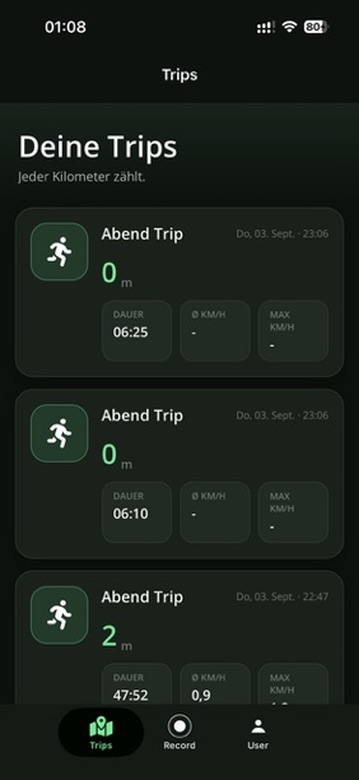

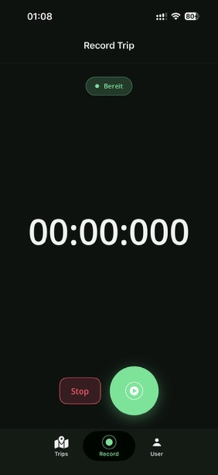


Android

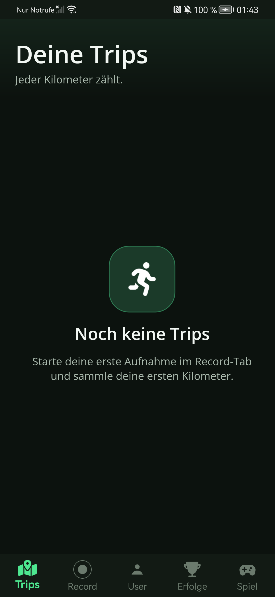

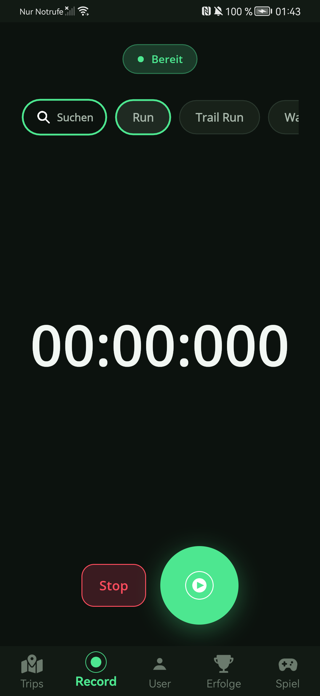

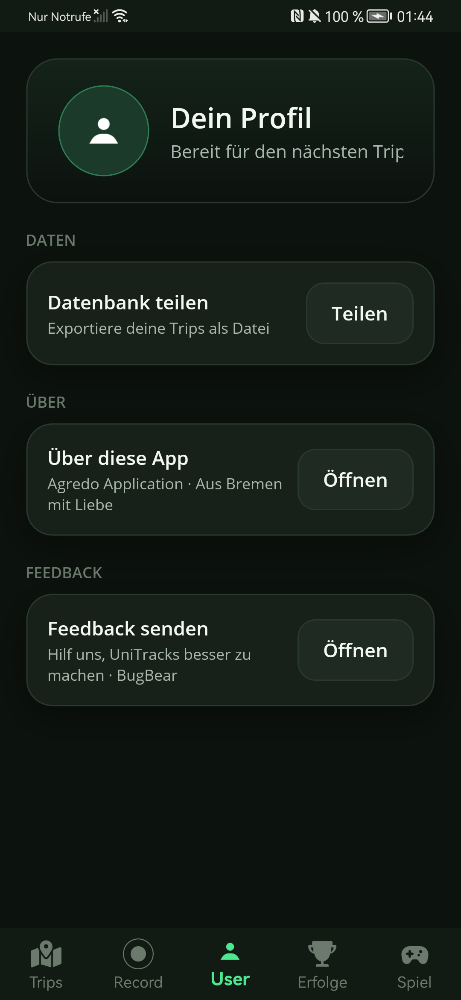

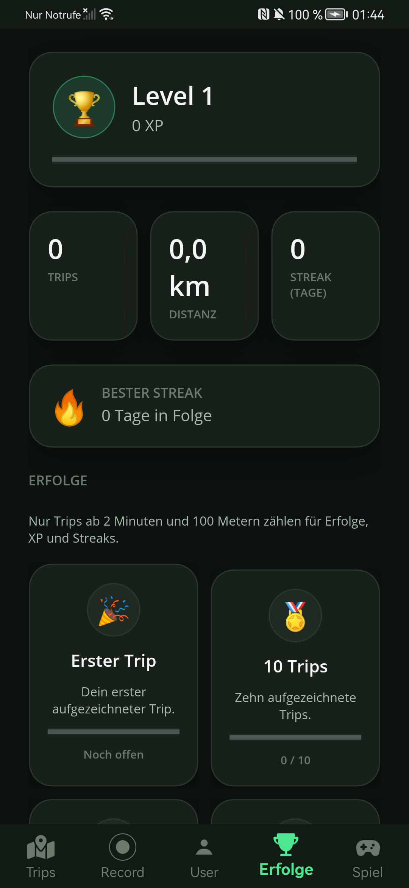

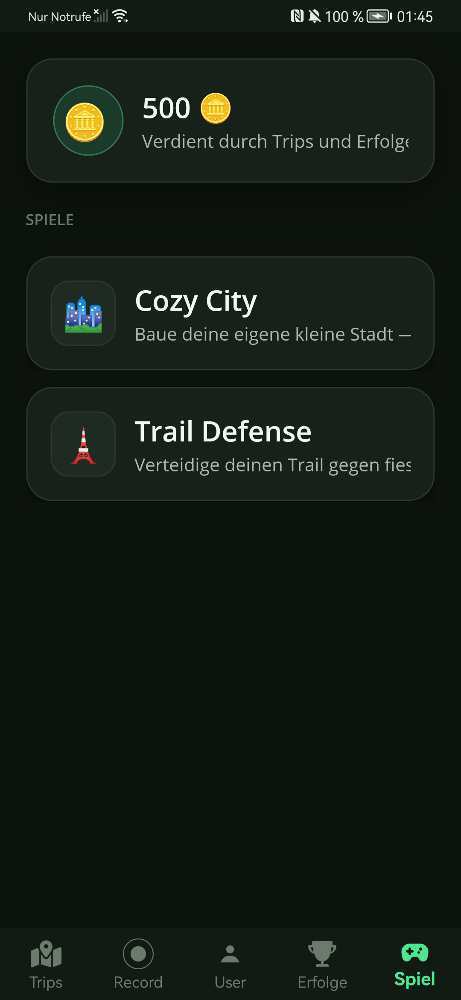

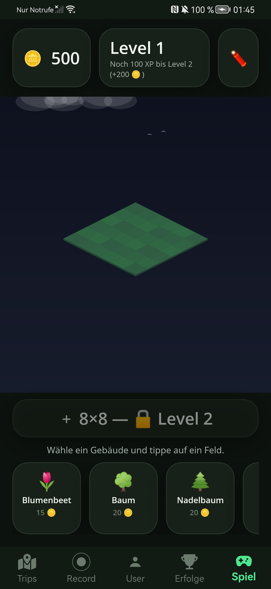

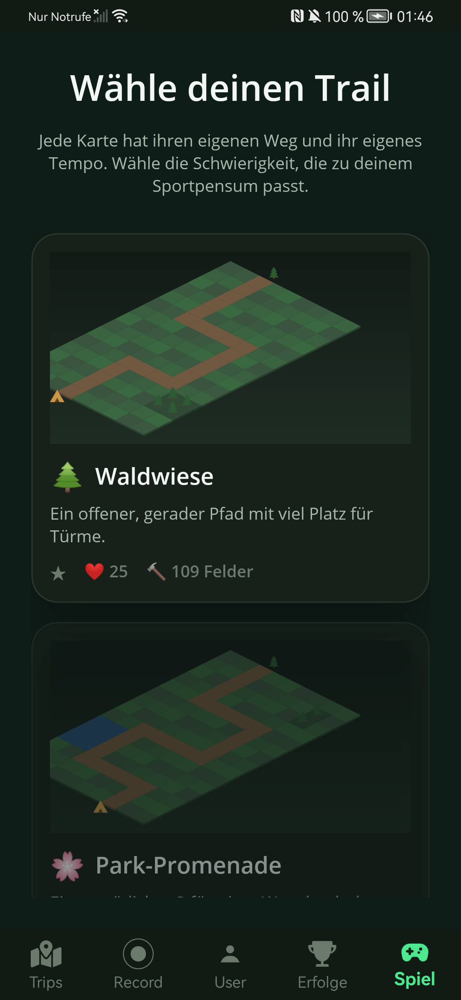

Windows

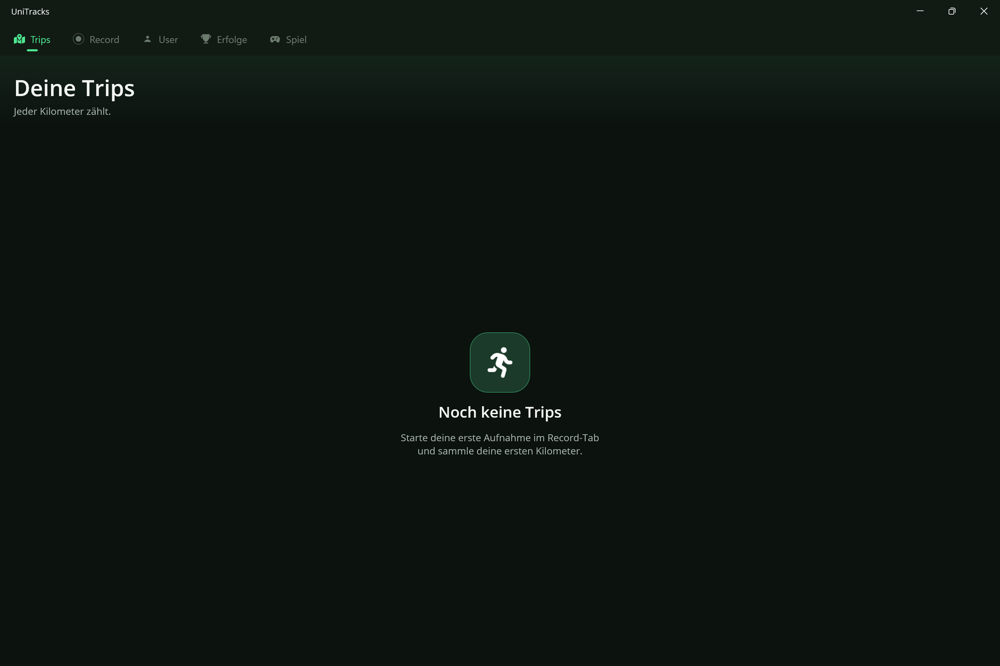

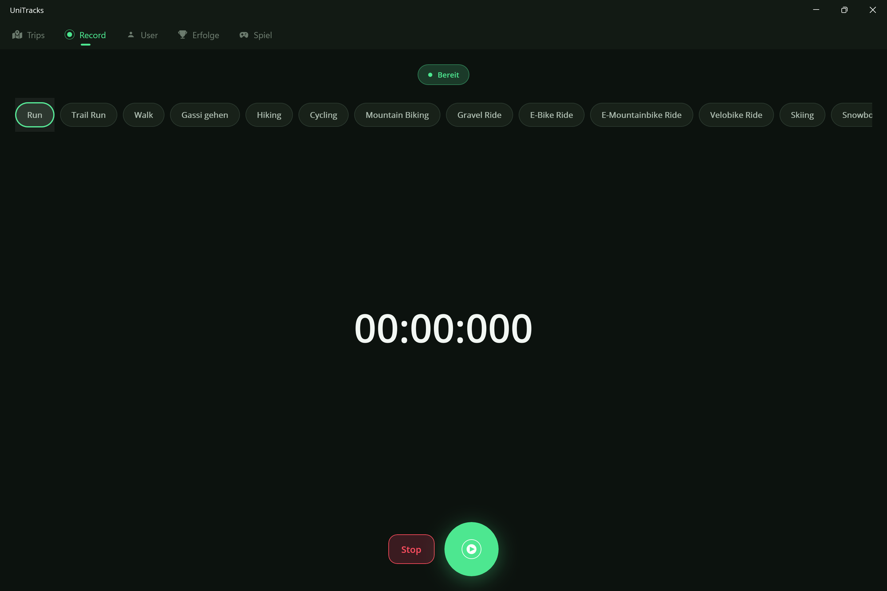

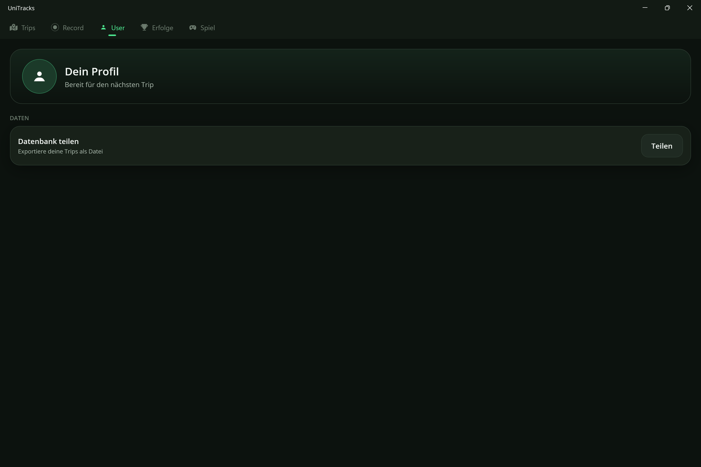

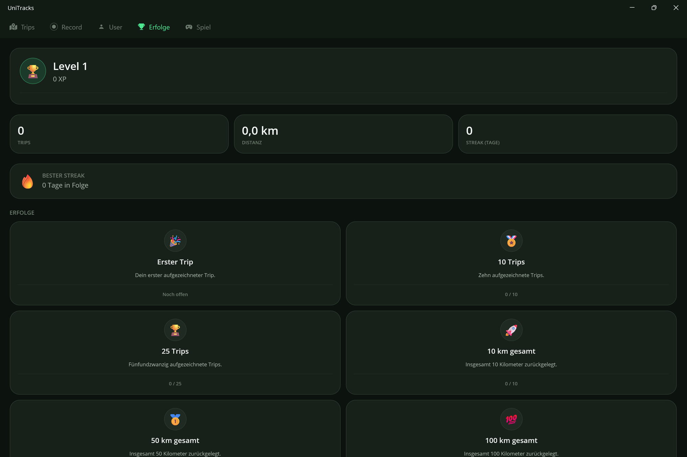

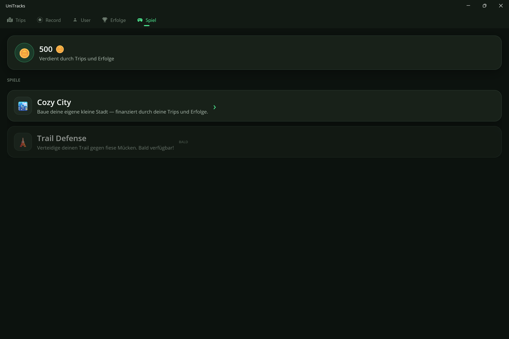

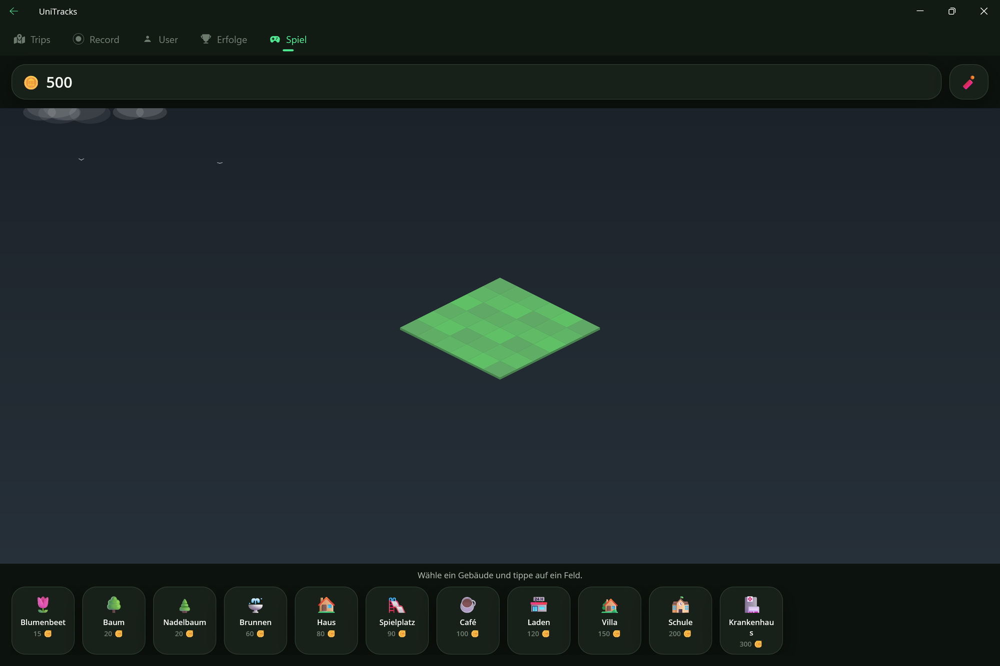

## Versionshinweise

Nach einem Update zeigt die App einmalig ein Popup mit den Änderungen der neuen Version und den bis zu drei
vorherigen Releases. Die Inhalte stehen in [`UniTracks.Services/Changelog/changelog.json`](UniTracks.Services/Changelog/changelog.json),
das als Embedded Resource in die App wandert.

**Pflege:** Beim Versionssprung in `UniTracks.Maui/UniTracks.Maui.csproj` (`ApplicationDisplayVersion`) einen
neuen Block **oben** im `releases`-Array ergänzen — Version, Datum (`yyyy-MM-dd`), Titel und die Änderungen.
`kind` ist `feature` (Badge „NEU“), `improvement` („GEÄNDERT“) oder `fix` („BEHOBEN“); statt eines Objekts ist
auch ein reiner String erlaubt.

```json
{
  "version": "1.0",
  "date": "2026-09-20",
  "title": "Titel der Version",
  "changes": [
    { "kind": "feature", "text": "Die Laufrichtung wird auf der Strecke angezeigt." }
  ]
}
```

Ein fehlender oder fehlerhafter Eintrag bricht nichts: das Popup fällt auf die neueste Version zurück, und die
Reihenfolge wird numerisch aus `version` bestimmt (nicht aus der Position in der Datei).

## Architektur

Saubere Trennung in einzelne Projekte (Nexile-Stil), MVVM mit **CommunityToolkit.Mvvm** Source-Generatoren:

```
UniTracks.Maui            → App-Head (Composition Root, MauiProgram, Styles, Plattform-Code)
UniTracks.Maui.Views      → Pages, Tabs, Controls (XAML), Custom Controls mit [BindableProperty]
UniTracks.Maui.Services   → Plattform-Services (GPS-Listener, Dispatcher)
UniTracks.ViewModels      → ViewModels ([ObservableProperty], [RelayCommand])
UniTracks.Services        → App-Logik (Tracking, Data-Services, Gamification, Game-Services)
UniTracks.Games           → Spiele-Logik, dependency-frei; ein Ordner pro Spiel (CityBuilder/, TowerDefense/),
                            geteilter Code in Shared/ (Coin-Wirtschaft), Spiele-Katalog in Catalog/
UniTracks.Data            → Persistenz: Entity Framework Core (SQLite) + LiteDB
UniTracks.Models          → Domänen-Modelle (Trip, Location, User, Weather)
UniTracks.Core            → Basis-Abstraktionen
UniTracks.Common          → Geteilte Konstanten/Utilities
```

Zentrale Versionsverwaltung aller Pakete in `Directory.Build.props` / `projects.props`.

## Tech-Stack

| Bereich | Technologie |
|---|---|
| Framework | .NET 11 / .NET MAUI 11 (Preview) |
| MVVM | CommunityToolkit.Mvvm 8.4 + AgredoApplication.MVVM.Services |
| UI-Toolkit | CommunityToolkit.Maui 15 (Popups, Behaviors, `[BindableProperty]`-Generator) |
| Karten | Mapsui.Maui 5.1 (SkiaSharp, OpenStreetMap-Tiles) |
| Game-Rendering | SkiaSharp 3.119 (prozedurale Vektor-Sprites, isometrische Karte) |
| Datenbank | EF Core 11 (SQLite) + LiteDB |
| Plattformen | Android 24+, iOS 16+, MacCatalyst 15+, Windows 10.0.17763+ |

## Build & Run

Voraussetzung: .NET 11 SDK mit MAUI-Workload (`dotnet workload install maui`).

```bash
# Windows
dotnet build UniTracks.Maui/UniTracks.Maui.csproj -f net11.0-windows10.0.26100.0 -t:Run

# Android
dotnet build UniTracks.Maui/UniTracks.Maui.csproj -f net11.0-android -t:Run

# iOS / MacCatalyst (macOS)
dotnet build UniTracks.Maui/UniTracks.Maui.csproj -f net11.0-ios -t:Run
```

> ⚠️ Klassenbibliotheken sind `net11.0`-only — das `-f`-Flag nur auf dem App-Head (`UniTracks.Maui`) verwenden, nicht auf der Solution.

## Datenschutz

UniTracks speichert **alle Daten ausschließlich lokal** auf dem Gerät. Keine Cloud, kein Tracking, keine Analyse-Drittanbieter. Karten-Tiles werden von OpenStreetMap geladen.
